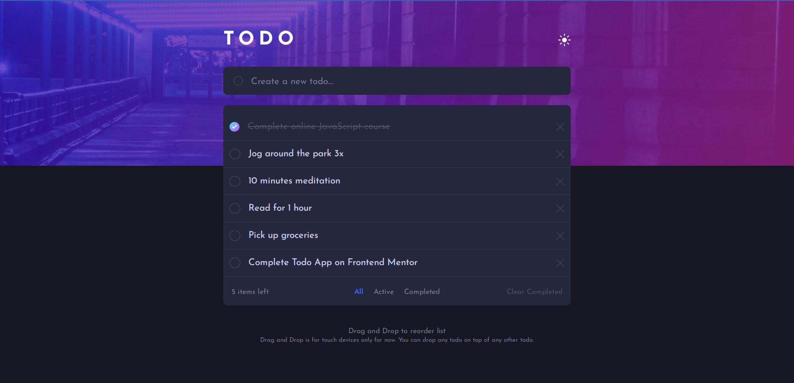
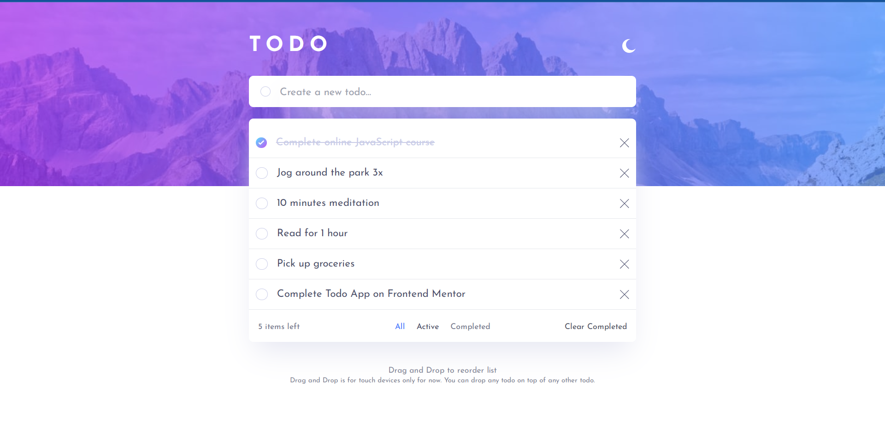
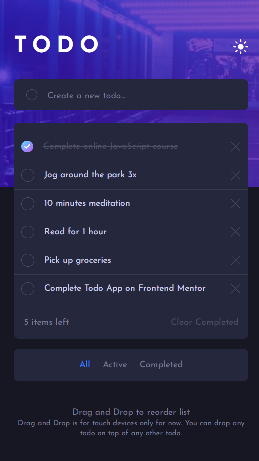
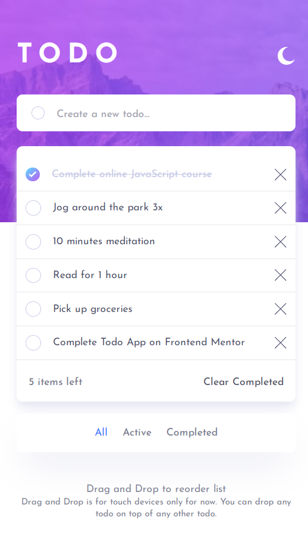

# Frontend Mentor - Todo app solution

This is a solution to the [Todo app challenge on Frontend Mentor](https://www.frontendmentor.io/challenges/todo-app-Su1_KokOW). Frontend Mentor challenges help you improve your coding skills by building realistic projects.

## Table of contents

- [Overview](#overview)
  - [The challenge](#the-challenge)
  - [Screenshot](#screenshot)
  - [Links](#links)
- [My process](#my-process)
  - [Built with](#built-with)
  - [What I learned](#what-i-learned)
  - [Continued development](#continued-development)
  - [Useful resources](#useful-resources)

## Overview

This was challenged by frontendmentor.io, I really enjoyed building it. The most stressful and fun part was drag and drop functionality. Which I accomplished using react-dnd library.

### The challenge

Users should be able to:

- View the optimal layout for the app depending on their device's screen size
- See hover states for all interactive elements on the page
- Add new todos to the list
- Mark todos as complete
- Delete todos from the list
- Filter by all/active/complete todos
- Clear all completed todos
- Toggle light and dark mode
- **Bonus**: Drag and drop to reorder items on the list

### Screenshot

Below are the screenshots of how the app looks like on mobile and desktop both in dark and light mode.

### Desktop - Dark

### Desktop - Light

### Mobile - Dark

### Mobile - Light

### Links

- Solution URL: [Github repo URL](https://github.com/AbroShahzeb/todo-app)
- Live Site URL: [Live site URL](https://abroshahzeb.github.io/todo-app/)

## My process

### Built with

- Used Semantic HTML5 Markup
- Tailwind css - For styles
- Vite + React
- Mobile-first approach

### What I learned

I learnt a lot from this project. From planning to execution. I didn't know about how the drag and drop functionality worked. But thanks to this project, I got insight of that too. Furthermore, I learnt more about state management in React and its useEffect() hook.

### Continued development

I would like to learn more about drag and drop workflow and add these functionalities in my futue app.

### Useful resources

- [ChatGPT](chat.openai.com) - This helped me alot when I was stuck on logic and drag and drop functionaities.
- [Youtube](https://www.youtube.com) - Youtube helped me alot about drag and drop in React using react-dnd library.
